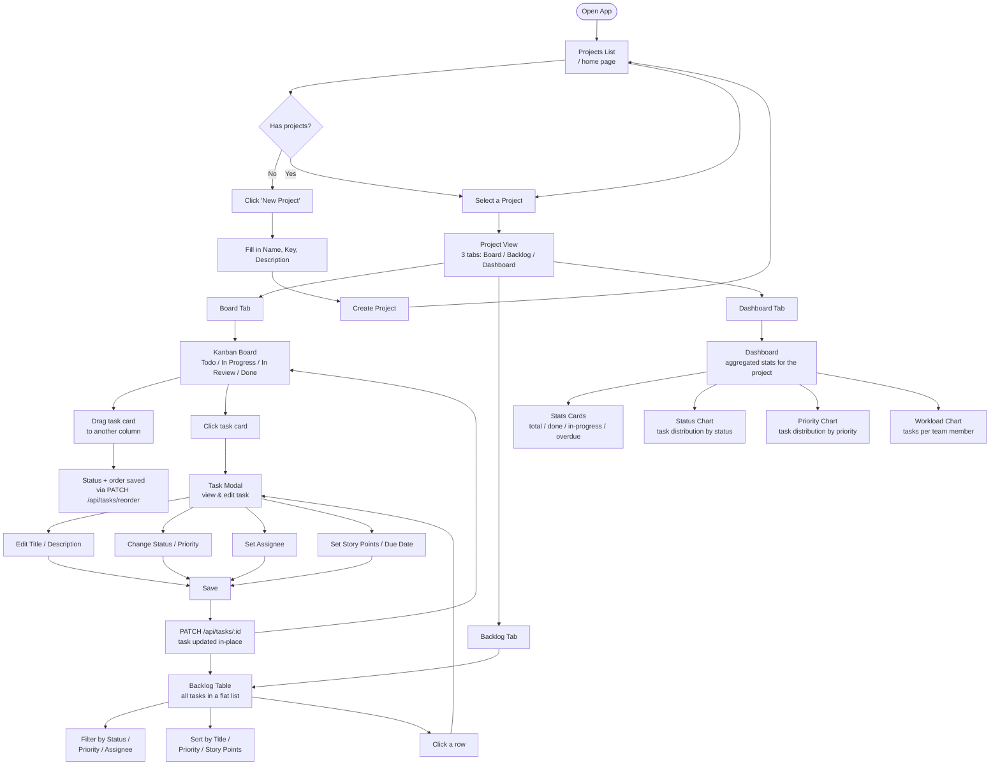

# Agentic PM — Main User Flow

## Key interactions at a glance

| Where | What the user does | Result |
|---|---|---|
| Projects list | Create project | New project added, redirected back to list |
| Board | Drag task card | Status & order persisted immediately |
| Board / Backlog | Click task | Task Modal opens for editing |
| Task Modal | Edit fields & Save | Task updated via API, view refreshed in-place |
| Backlog | Filter / Sort | Client-side filtering, no extra API call |
| Dashboard | View only | Aggregated stats loaded from `/api/dashboard/:projectId` |
