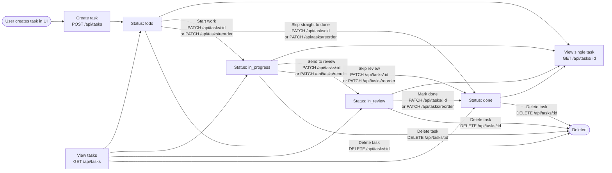

 # Task lifecycle and APIs

This diagram is based on `types/index.ts`, `lib/db.ts`, the task API routes under `app/api/tasks`, and the task UI flows in `components/board/KanbanBoard.tsx` and `components/tasks/TaskModal.tsx`.

